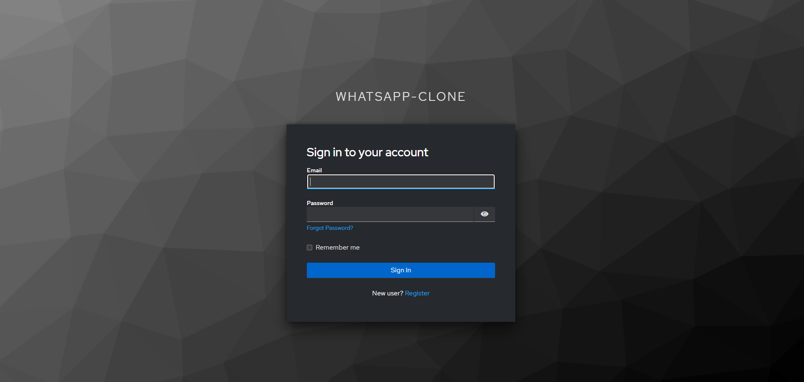
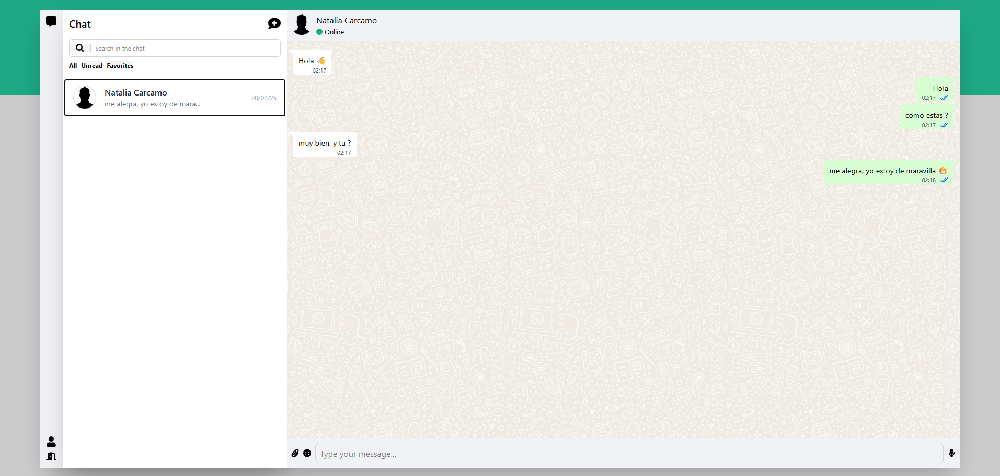

# 💬 WhatsApp Clone – React + TypeScript + Vite

A modern **WhatsApp Clone UI** built with **React**, **TypeScript**, and **Vite**. This project replicates the core features of WhatsApp Web, including real-time chat, authentication, notifications, and a responsive design.

---

## 🚀 Features

- ✅ User authentication (Keycloak integration)
- ✅ Real-time chat with contacts
- ✅ Send and receive messages
- ✅ Chat list and contact management
- ✅ Notifications for new messages
- ✅ Responsive design (custom CSS)
- ✅ State management with React Context API
- ✅ Modular architecture (Auth, Chat, Message, Notification, User)

---

## 🛠️ Requirements

- **Node.js 18+**
- **npm 9+**

---

## 📦 Installation

### 1️⃣ Clone the Repository

```bash
git clone https://github.com/Ovtt17/whatsapp-clone-ui.git
cd whatsapp-clone-ui
```

---

### 2️⃣ Install Dependencies

```bash
npm install
```

---

### 3️⃣ Configure Environment Variables

Create a `.env` file in the root directory and add your environment variables:

```env
VITE_API_URL='http://localhost:8080/api/v1'
VITE_KEYCLOAK_URL='http://localhost:8080/realms/your-realm'
VITE_KEYCLOAK_CLIENT_ID='your-client-id'
```

---

### 4️⃣ Run the Application

```bash
npm run dev
```

The app will be available at:

```txt
http://localhost:5173
```

---

## 🧩 Modules

This project is divided into the following modules:

- **Auth:** Login and authentication with Keycloak
- **Chat:** Chat list, chat content, and sidebar options
- **Message:** Send and receive messages in real time
- **Notification:** In-app notifications for new messages
- **User:** Manage contacts and user profiles

---

## 🖼️ Screenshots

Below are screenshots of the main functionalities:

### Login


_Securely access the application with your credentials using a simple and intuitive login form using Keycloak._

### Chat Window


_Send and receive messages in real time with a clean and modern interface._

### Demo

_See how the application works in real time._

---

## 👤 User Profile

![]
Each authenticated user can:

- View and manage their contacts
- Start new chats
- Receive notifications for new messages

---

## 🤝 Contributing

Want to help improve the app? Here's how:

1. Fork the repository
2. Create a new branch:

   ```bash
   git checkout -b feature/your-feature
   ```

3. Commit your changes:

   ```bash
   git commit -am 'Add new feature'
   ```

4. Push to your fork:

   ```bash
   git push origin feature/your-feature
   ```

5. Open a **Pull Request**

---

## 📄 License

This project is licensed under the [MIT License](LICENSE).

---

## 📬 Contact

For questions, ideas, or feedback, feel free to [open an issue](https://github.com/Ovtt17/whatsapp-clone-ui/issues).

---

## 🌐 API Backend

You can find and try the WhatsApp Clone API (backend) here:

[Go to WhatsApp Clone API](https://github.com/Ovtt17/whatsapp-clone-api)

---
